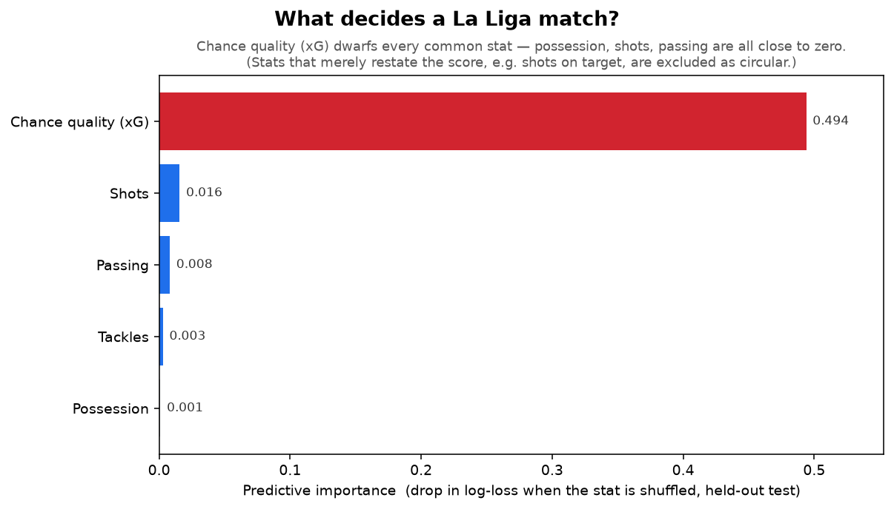
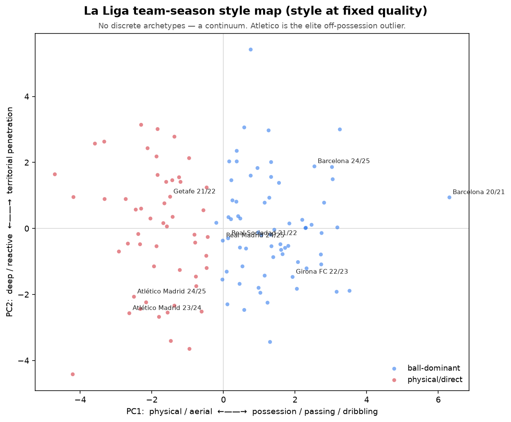
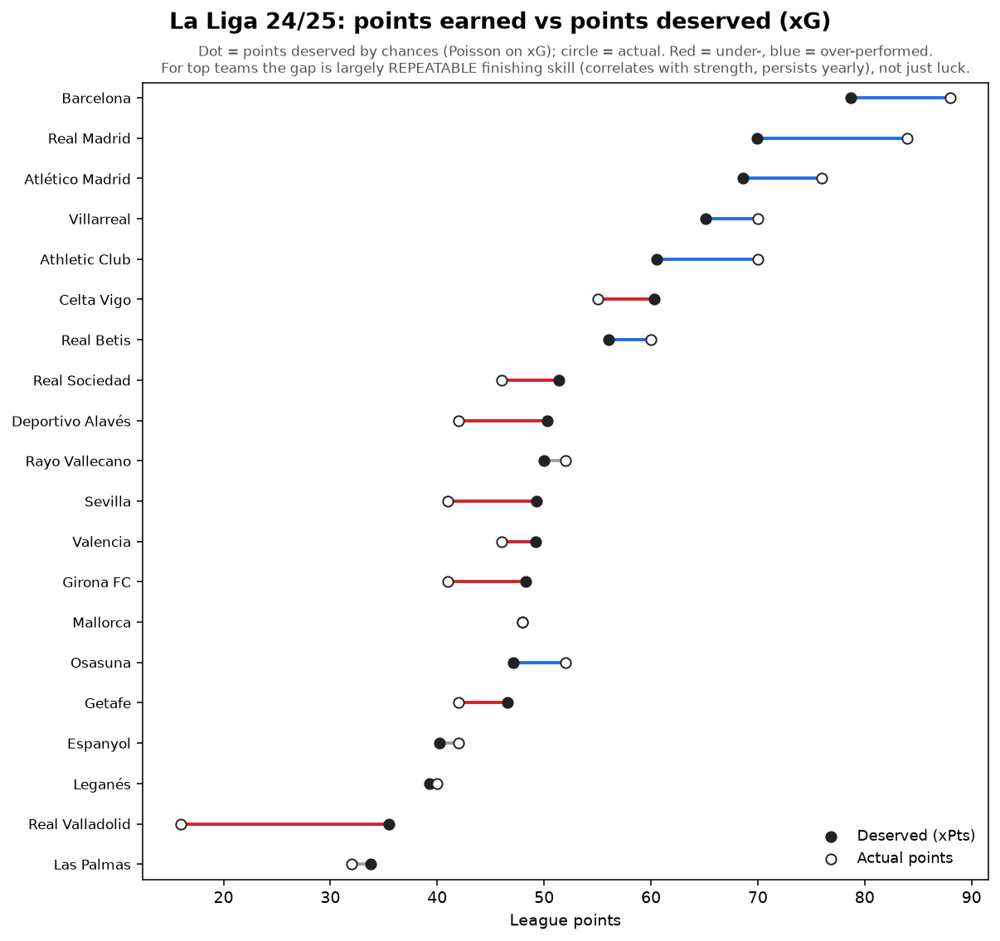

# La Liga Football-Analytics Engine

A machine-learning study of six La Liga seasons that asks one question plainly:
**what actually decides a football match — and how much of it can you predict before kickoff?**

None of the answers will surprise someone who watches a lot of football — *chances win games,
possession is overrated, there's more than one way to be a good team.* **That is the point.** The
value isn't a new claim; it's taking those intuitions and **checking them properly**

> **The full breakdown is the notebook.** This README is the helicopter view. For the real analysis —
> the figures, the numbers, the method explained in one plain sentence at a time, the code and its
> outputs — read the case study:
> **[`notebooks/la-liga-analytics-case-study.ipynb`](notebooks/la-liga-analytics-case-study.ipynb)**
> (it renders on GitHub, nothing to install).

## What it found

**1. Chance quality decides matches — almost nothing else does.** Across 2,280 matches, once you
strip out the stats that secretly *are* the score, **expected goals (xG) — the quality of the chances
a team creates — is the one clear driver, and it dwarfs everything else. Possession does not decide
matches.**



*So what makes a good xG?* Two things, mostly: taking **more shots**, and taking them from **better
places** (inside the box, not from distance). Possession buys *more* shots, not *better* ones — the
real skill is getting into the box. Splitting chances any finer — open play vs set-pieces vs counters
— would need shot-by-shot data this dataset doesn't include. **That missing data is the limit, not the
method.**

**2. Predicting a single match hits a hard ceiling.** A simple team-strength rating built from past
results does most of the work that can be done; richer signals — recent xG form, who's available today
— barely add to it. A single match is mostly team strength plus a lot of irreducible luck, so the
honest route to more accuracy is more data, not more clever features.

**3. What makes a team good — and is there one "right" way to play?** Turning the question around (using
team strength as the *target*), great La Liga teams **dominate the ball, get into the box more, and
foul less.** But **there is no single winning style** — grouping teams by how they play finds a smooth
continuum, not a handful of types, and style barely relates to greatness. The standout exception:
**Atlético, genuinely elite off a non-possession identity.**



A football-friendly companion exhibit — the **xG table**: the points each team's chances *deserved*
versus what they actually earned. The gap is finishing and goalkeeping, and for the top teams it is
mostly repeatable skill, not luck.




## What's in here

```
src/data_tool/   the engine: the data ingester, the analyses, the demo CLI
notebooks/       the case study -- executed, with figures inline (start here)
docs/figures/    the committed exhibit images
data/            licensed raw data is NOT included -- see data/README.md
```

## Running it

> **The licensed match data is not part of this repo** (see [`data/README.md`](data/README.md)). Every
> `make` step — **including `make test`** — needs a local copy of that data (so `make test` will not complete without it). What needs *nothing*
> is the [notebook](notebooks/la-liga-analytics-case-study.ipynb) and the figures in
> [`docs/figures/`](docs/figures/) — they are already rendered.

```bash
python3 -m venv .venv && source .venv/bin/activate
pip install -r requirements.txt     # macOS: brew install libomp (for LightGBM)
make help                           # list every step
make test                           # run the selfchecks (needs the local data)
```
